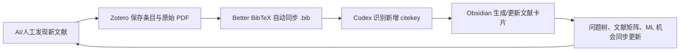
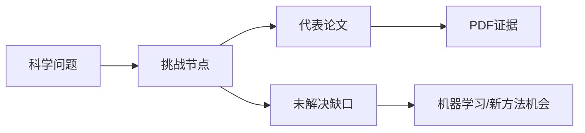

# Obsidian + Zotero + Codex Research Map

把科研文献从“论文清单”整理成“科学问题树”的一套开源工作流。

这个仓库总结了一套可复用方法：Zotero 负责文献条目和 PDF，Obsidian 负责问题树、文献卡片和知识图谱，Codex 负责批量整理、PDF 精读、节点更新和 GitHub 发布。

这不是一次性整理，而是一个会随着研究不断长大的系统：



仓库包含两个版本：

- `examples/gravity-magnetic/`：重力磁力反演实例版，围绕传统位场反演、交叉梯度联合反演、深度学习重磁联合反演、生成式后验和合成数据泛化组织。
- `examples/general-template/`：通用科研问题树模板版，可以迁移到任意学科方向。

## 核心思想

不要把文献综述写成“按年份排列的摘要”。更好的结构是：



每篇论文回答一个问题：

- 它解决了哪个科学问题？
- 它解决到什么程度？
- 它依赖什么假设？
- 它留下什么空白？
- 这个空白是否适合用机器学习、生成式模型或物理约束学习来解决？

## 仓库结构

```text
.
├─ docs/                         # 方法论和安装操作
├─ examples/
│  ├─ gravity-magnetic/           # 重磁反演实例版
│  └─ general-template/           # 通用模板版
├─ templates/                     # Obsidian 笔记模板
├─ configs/obsidian/              # 插件配置示例，不含隐私路径或密钥
├─ prompts/                       # 可直接给 Codex 的提示词
├─ AGENTS.md                      # Codex 维护本仓库时的约定
└─ SECURITY.md                    # 开源前隐私检查
```

## 快速开始

1. 安装 Obsidian、Zotero、Better BibTeX for Zotero。
2. 在 Obsidian 中安装 Dataview、Zotero Integration、Mermaid Tools、Advanced Canvas、Excalidraw、Terminal；可选安装 Copilot、Text Generator。
3. 按 `docs/01-setup-step-by-step.md` 创建文件夹和模板。
4. 在 Zotero 中保存 PDF 和元数据，用 Better BibTeX 设置“Keep updated”自动导出 `.bib` 到 `Zotero/导出文件/`。
5. 用 Zotero Integration 把文献导入 `Zotero/文献卡片/`，或让 Codex 从同步 `.bib` 批量生成文献卡片。
6. 用 `prompts/01-import-bibtex.md`、`prompts/02-read-pdf-update-tree.md`、`prompts/04-ai-literature-discovery.md` 让 Codex 扩展文献库并更新问题树。

## 已安装/推荐插件

本工作流的示例来自一个实际 Obsidian vault，安装过这些插件：

| 插件 | 示例版本 | 用途 | 是否核心 |
|---|---:|---|---|
| Terminal | 3.26.0 | 在 Obsidian 内运行 `git`、`rg`、`python`、BibTeX 检查命令 | 是 |
| Dataview | 0.5.68 | 自动生成文献矩阵、问题节点表、待读列表 | 是 |
| Zotero Integration | 3.2.1 | 从 Zotero 导入文献卡片、PDF 注释和图片 | 是 |
| Advanced Canvas | 6.2.1 | 维护科研问题树的空间图谱 | 是 |
| Excalidraw | 2.23.12 | 绘制方法框架图、概念草图、论文图示草稿 | 是 |
| Mermaid Tools | 1.4.1 | 编辑 `mindmap`、`flowchart` 等 Mermaid 图 | 是 |
| Copilot | 3.3.3 | 在 Obsidian 内进行局部 AI 问答和笔记草稿 | 可选 |
| Text Generator | 0.8.7 | 单篇笔记的 AI 文本生成 | 可选 |

## 插件配置速览

下面这部分是 README 版的完整配置说明。更细的截图教程和踩坑记录见 [docs/09-plugin-configuration-deep-dive.md](docs/09-plugin-configuration-deep-dive.md)。

### 1. Zotero + Better BibTeX

目标是让 Zotero 文献库变大时，自动更新一个 `.bib` 文件，Codex 再根据这个 `.bib` 增量更新 Obsidian。


操作：

1. 安装 Zotero Desktop。
2. 安装 Better BibTeX for Zotero。
3. 在 Zotero 中新建一个 collection，例如 `Research Map - Gravity Magnetic Inversion`。
4. 把要进入知识图谱的论文放入这个 collection。
5. 右键 collection，选择 `Export Collection...`。
6. Format 选择 `Better BibTeX`。
7. 勾选 `Keep updated`。
8. 导出到 Obsidian vault 内，例如 `Zotero/导出文件/research-library.bib`。

关键点：

- 只导出研究 collection，不建议导出整个 Zotero library。
- citekey 规则确定后尽量不要频繁改变。
- `.bib` 放在 Obsidian vault 中，便于 Codex、Dataview 和 Git 统一管理。
- 不要把 Zotero `storage` 文件夹或原始 PDF 放进公开仓库。

### 2. Zotero Connector

目标是从网页、出版社页面、DOI 页面把元数据和 PDF 保存进 Zotero。

操作：

1. 安装浏览器版 Zotero Connector。
2. 打开 Zotero Desktop。
3. 打开论文的出版社页面、数据库页面或 DOI 页面。
4. 点击浏览器工具栏的 Zotero 保存按钮。
5. 回到 Zotero 检查标题、作者、年份、DOI、期刊和 PDF 是否正确。
6. 把条目拖入研究 collection。

常见问题：

- 只保存了 PDF，没有元数据：尽量从论文详情页保存，不要只拖 PDF。
- Connector 没反应：先确认 Zotero Desktop 正在运行。
- PDF 没自动下载：可能是权限或机构访问问题，先保存元数据，再手动补 PDF。

### 3. Obsidian 社区插件

目标是在 Obsidian 里启用文献矩阵、Zotero 导入、图谱展示和终端维护能力。


推荐安装顺序：

1. Dataview
2. Zotero Integration
3. Mermaid Tools
4. Advanced Canvas
5. Excalidraw
6. Terminal
7. 可选：Copilot、Text Generator

操作：

1. 打开 Obsidian `Settings`。
2. 进入 `Community plugins`。
3. 关闭 `Restricted mode`。
4. 点击 `Browse` 搜索插件名。
5. 点击 `Install`。
6. 安装后点击 `Enable`。

常见问题：

- 安装插件后还要手动启用，否则不会生效。
- `.obsidian/community-plugins.json` 只记录启用列表，不等于插件本体都已安装。
- Copilot、Text Generator 等 AI 插件的 `data.json` 可能包含 provider、模型和 key，不要公开。

### 4. Zotero Integration

目标是从 Zotero 导入文献卡片、引用信息、PDF 注释和注释图片。


推荐配置：

```json
{
  "database": "Zotero",
  "noteImportFolder": "Zotero",
  "outputPathTemplate": "文献卡片/{{citekey}}.md",
  "imageOutputPathTemplate": "附件图片/{{citekey}}/",
  "templatePath": "Zotero/模板/Zotero文献卡片模板.md",
  "openNoteAfterImport": true
}
```

配置逻辑：

- `noteImportFolder` 是导入根目录。
- `outputPathTemplate` 决定文献卡片路径。
- `imageOutputPathTemplate` 决定 PDF 注释图片路径。
- `templatePath` 指向 Obsidian 中的 Zotero 文献卡片模板。
- 模板变量使用 Nunjucks，例如 `{{citekey}}`、`{{title}}`、`{{authorString}}`、`{{year}}`、`{{DOI}}`、`{{zoteroSelectURI}}`。

常见问题：

- citekey 为空：检查 Zotero 是否安装 Better BibTeX，条目是否有 citation key。
- 导入路径不对：`noteImportFolder` 和 `outputPathTemplate` 是拼接关系。
- PDF 注释没有导入：确认注释是在 Zotero PDF reader 中生成的。
- Zotero 没运行：Obsidian 可能找不到 Zotero 条目。

### 5. Dataview

目标是把文献卡片和问题节点的 YAML 字段自动变成表格。


文献矩阵示例：

```dataview
TABLE year, methods, solves, evidence_level, status
FROM "Zotero/文献卡片"
WHERE contains(["paper", "literature"], type)
SORT year ASC
```

问题节点表示例：

```dataview
TABLE status AS "传统状态", ml_opportunity AS "ML机会", domains AS "适用领域"
FROM "重磁反演知识图谱/问题节点"
WHERE type = "problem"
SORT ml_opportunity DESC
```

常见问题：

- YAML 字段名必须统一，`evidence_level` 和 `evidence-level` 会被视为两个字段。
- Markdown 表格里不要直接塞复杂 wiki link，`|` 可能破坏表格。
- Dataview 只负责查询显示，不会替你修改笔记；批量写入交给 Codex。

### 6. Canvas、Mermaid、Excalidraw

三者分工：

- Mermaid：适合在总览页维护 `mindmap`、`flowchart`、路线图。
- Advanced Canvas：适合把科学挑战、代表论文、ML 机会、PDF 底稿摆成空间图谱。
- Excalidraw：适合画机制图、方法框架图、论文插图草稿。

建议：

- 总览图只放结构，不塞长证据。
- 证据写在文献卡片和问题节点里。
- Canvas 不要放入每一篇论文，否则会很快变乱。

### 7. Terminal、Codex 和 AI 插件

Terminal 是 Obsidian 内的命令入口，Codex 是跨文件维护者，Copilot/Text Generator 是局部写作助手。

常用命令：

```powershell
git status --short
rg -n "pdf_path: \"\"" "Zotero/文献卡片"
rg -n "type: problem" "重磁反演知识图谱/问题节点"
rg -n "TODO|待补|缺 PDF" .
```

推荐分工：

- Terminal：快速检查 Git、路径、字段和待办。
- Codex：批量读 `.bib`、生成文献卡片、读取 PDF、更新问题树、提交 GitHub。
- Copilot：问当前笔记、局部总结。
- Text Generator：生成单篇笔记的段落草稿。

不要把 API key、token、AI 插件私有配置、Zotero storage、原始 PDF 放进公开仓库。

## 官方教程入口

这些是 README 中配置方案对应的官方或维护者文档：

- [Obsidian Community Plugins](https://help.obsidian.md/community-plugins)
- [Better BibTeX automatic export](https://retorque.re/zotero-better-bibtex/exporting/auto/)
- [Better BibTeX for Zotero](https://retorque.re/zotero-better-bibtex/)
- [Zotero 添加条目](https://www.zotero.org/support/adding_items_to_zotero)
- [Zotero Connector](https://www.zotero.org/download/connectors)
- [Zotero Connector 故障排查](https://www.zotero.org/support/troubleshooting_translator_issues)
- [Obsidian Zotero Integration](https://github.com/mgmeyers/obsidian-zotero-integration)
- [Zotero Integration 模板语法](https://github.com/mgmeyers/obsidian-zotero-integration/blob/main/docs/Templating.md)
- [Dataview 文档](https://blacksmithgu.github.io/obsidian-dataview/)
- [Dataview 查询结构](https://blacksmithgu.github.io/obsidian-dataview/queries/structure/)
- [Obsidian Copilot](https://github.com/logancyang/obsidian-copilot)
- [Text Generator](https://github.com/nhaouari/obsidian-textgenerator-plugin)

## 动态扩库工作流

当 Zotero 文献库变大时，不需要手动重建 Obsidian 图谱：

1. Zotero 中新增论文和 PDF。
2. Better BibTeX 自动更新 `Zotero/导出文件/research-library.bib`。
3. Codex 读取 `.bib`，对比已有文献卡片的 `citekey`。
4. 只为新增文献生成卡片，旧卡片不覆盖人工精读内容。
5. Codex 根据 title/abstract/keywords 初步挂接问题节点。
6. 如果 `pdf_path` 可用，Codex 进一步读取 PDF，补 `PDF 精读证据`。
7. Dataview 和文献矩阵自动反映新增文献。

教程见 `docs/06-growing-library-with-bib-sync.md`。

## AI 搜索文献并进入 Zotero

推荐采用“候选清单先行”的半自动方式：

1. Codex/AI 按研究问题搜索 Crossref、OpenAlex、Semantic Scholar、arXiv、出版社页面等公开来源。
2. AI 输出候选清单：title、authors、year、venue、DOI、URL、摘要、对应问题节点、推荐理由。
3. 研究者确认哪些要纳入。
4. 把 DOI 批量粘贴到 Zotero 的 `Add Item(s) by Identifier`，或用 Zotero Connector 在论文页面保存。
5. Zotero 下载元数据和 PDF。
6. Better BibTeX 自动同步 `.bib`。
7. Codex 导入新增 citekey 并更新 Obsidian。

完整方案见 `docs/07-ai-literature-discovery-to-zotero.md`。

如果只想照着一步步执行，直接看 `docs/08-operational-playbook.md`。

如果要看每个 Obsidian/Zotero 插件的详细配置、示意截图、教程链接和踩坑记录，看 [docs/09-plugin-configuration-deep-dive.md](docs/09-plugin-configuration-deep-dive.md)。

## 适合谁

- 想把 Zotero 文献变成可维护知识图谱的研究者。
- 想用 Obsidian 做系统综述、scoping review、文献矩阵的人。
- 想让 Codex 参与 PDF 精读、文献归类、研究空白提炼的人。
- 正在做重力、磁力、地球物理反演、机器学习反演的人。

## 不包含什么

本仓库不包含：

- 任何版权 PDF。
- Zotero `storage` 附件。
- 个人 Obsidian vault。
- API key、token、Copilot/Text Generator 私有配置。
- 完整 BibTeX 原始导出文件。

这些内容应保存在你自己的本地 Obsidian/Zotero 环境中。

## License

MIT License. See `LICENSE`.
