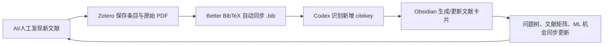
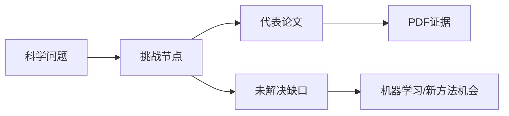

# Obsidian + Zotero + Codex Research Map

把科研文献从“论文清单”整理成“科学问题树”的一套开源工作流。

这个仓库总结了一套可复用方法：Zotero 负责文献条目和 PDF，Obsidian 负责问题树、文献卡片和知识图谱，Codex 负责批量整理、PDF 精读、节点更新和 GitHub 发布。

这不是一次性整理，而是一个会随着研究不断长大的系统：



仓库包含两个版本：

- `examples/gravity-magnetic/`：重力磁力反演实例版，围绕传统位场反演、交叉梯度联合反演、深度学习重磁联合反演、生成式后验和合成数据泛化组织。
- `examples/general-template/`：通用科研问题树模板版，可以迁移到任意学科方向。

## 核心思想

不要把文献综述写成“按年份排列的摘要”。更好的结构是：



每篇论文回答一个问题：

- 它解决了哪个科学问题？
- 它解决到什么程度？
- 它依赖什么假设？
- 它留下什么空白？
- 这个空白是否适合用机器学习、生成式模型或物理约束学习来解决？

## 仓库结构

```text
.
├─ docs/                         # 方法论和安装操作
├─ examples/
│  ├─ gravity-magnetic/           # 重磁反演实例版
│  └─ general-template/           # 通用模板版
├─ templates/                     # Obsidian 笔记模板
├─ configs/obsidian/              # 插件配置示例，不含隐私路径或密钥
├─ prompts/                       # 可直接给 Codex 的提示词
├─ AGENTS.md                      # Codex 维护本仓库时的约定
└─ SECURITY.md                    # 开源前隐私检查
```

## 快速开始

1. 安装 Obsidian、Zotero、Better BibTeX for Zotero。
2. 在 Obsidian 中安装 Dataview、Zotero Integration、Mermaid Tools、Advanced Canvas、Excalidraw、Terminal；可选安装 Copilot、Text Generator。
3. 按 `docs/01-setup-step-by-step.md` 创建文件夹和模板。
4. 在 Zotero 中保存 PDF 和元数据，用 Better BibTeX 设置“Keep updated”自动导出 `.bib` 到 `Zotero/导出文件/`。
5. 用 Zotero Integration 把文献导入 `Zotero/文献卡片/`，或让 Codex 从同步 `.bib` 批量生成文献卡片。
6. 用 `prompts/01-import-bibtex.md`、`prompts/02-read-pdf-update-tree.md`、`prompts/04-ai-literature-discovery.md` 让 Codex 扩展文献库并更新问题树。

## 已安装/推荐插件

本工作流的示例来自一个实际 Obsidian vault，安装过这些插件：

| 插件 | 示例版本 | 用途 | 是否核心 |
|---|---:|---|---|
| Terminal | 3.26.0 | 在 Obsidian 内运行 `git`、`rg`、`python`、BibTeX 检查命令 | 是 |
| Dataview | 0.5.68 | 自动生成文献矩阵、问题节点表、待读列表 | 是 |
| Zotero Integration | 3.2.1 | 从 Zotero 导入文献卡片、PDF 注释和图片 | 是 |
| Advanced Canvas | 6.2.1 | 维护科研问题树的空间图谱 | 是 |
| Excalidraw | 2.23.12 | 绘制方法框架图、概念草图、论文图示草稿 | 是 |
| Mermaid Tools | 1.4.1 | 编辑 `mindmap`、`flowchart` 等 Mermaid 图 | 是 |
| Copilot | 3.3.3 | 在 Obsidian 内进行局部 AI 问答和笔记草稿 | 可选 |
| Text Generator | 0.8.7 | 单篇笔记的 AI 文本生成 | 可选 |

详细配置见 `docs/02-obsidian-plugin-settings.md`。

## 动态扩库工作流

当 Zotero 文献库变大时，不需要手动重建 Obsidian 图谱：

1. Zotero 中新增论文和 PDF。
2. Better BibTeX 自动更新 `Zotero/导出文件/research-library.bib`。
3. Codex 读取 `.bib`，对比已有文献卡片的 `citekey`。
4. 只为新增文献生成卡片，旧卡片不覆盖人工精读内容。
5. Codex 根据 title/abstract/keywords 初步挂接问题节点。
6. 如果 `pdf_path` 可用，Codex 进一步读取 PDF，补 `PDF 精读证据`。
7. Dataview 和文献矩阵自动反映新增文献。

教程见 `docs/06-growing-library-with-bib-sync.md`。

## AI 搜索文献并进入 Zotero

推荐采用“候选清单先行”的半自动方式：

1. Codex/AI 按研究问题搜索 Crossref、OpenAlex、Semantic Scholar、arXiv、出版社页面等公开来源。
2. AI 输出候选清单：title、authors、year、venue、DOI、URL、摘要、对应问题节点、推荐理由。
3. 研究者确认哪些要纳入。
4. 把 DOI 批量粘贴到 Zotero 的 `Add Item(s) by Identifier`，或用 Zotero Connector 在论文页面保存。
5. Zotero 下载元数据和 PDF。
6. Better BibTeX 自动同步 `.bib`。
7. Codex 导入新增 citekey 并更新 Obsidian。

完整方案见 `docs/07-ai-literature-discovery-to-zotero.md`。

如果只想照着一步步执行，直接看 `docs/08-operational-playbook.md`。

如果要看每个 Obsidian/Zotero 插件的详细配置、示意截图、教程链接和踩坑记录，看 [docs/09-plugin-configuration-deep-dive.md](docs/09-plugin-configuration-deep-dive.md)。

## 适合谁

- 想把 Zotero 文献变成可维护知识图谱的研究者。
- 想用 Obsidian 做系统综述、scoping review、文献矩阵的人。
- 想让 Codex 参与 PDF 精读、文献归类、研究空白提炼的人。
- 正在做重力、磁力、地球物理反演、机器学习反演的人。

## 不包含什么

本仓库不包含：

- 任何版权 PDF。
- Zotero `storage` 附件。
- 个人 Obsidian vault。
- API key、token、Copilot/Text Generator 私有配置。
- 完整 BibTeX 原始导出文件。

这些内容应保存在你自己的本地 Obsidian/Zotero 环境中。

## License

MIT License. See `LICENSE`.
