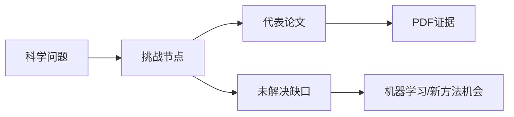

# Obsidian + Zotero + Codex Research Map

把科研文献从“论文清单”整理成“科学问题树”的一套开源工作流。

这个仓库总结了一套可复用方法：Zotero 负责文献条目和 PDF，Obsidian 负责问题树、文献卡片和知识图谱，Codex 负责批量整理、PDF 精读、节点更新和 GitHub 发布。

仓库包含两个版本：

- `examples/gravity-magnetic/`：重力磁力反演实例版，围绕传统位场反演、交叉梯度联合反演、深度学习重磁联合反演、生成式后验和合成数据泛化组织。
- `examples/general-template/`：通用科研问题树模板版，可以迁移到任意学科方向。

## 核心思想

不要把文献综述写成“按年份排列的摘要”。更好的结构是：



每篇论文回答一个问题：

- 它解决了哪个科学问题？
- 它解决到什么程度？
- 它依赖什么假设？
- 它留下什么空白？
- 这个空白是否适合用机器学习、生成式模型或物理约束学习来解决？

## 仓库结构

```text
.
├─ docs/                         # 方法论和安装操作
├─ examples/
│  ├─ gravity-magnetic/           # 重磁反演实例版
│  └─ general-template/           # 通用模板版
├─ templates/                     # Obsidian 笔记模板
├─ configs/obsidian/              # 插件配置示例，不含隐私路径或密钥
├─ prompts/                       # 可直接给 Codex 的提示词
├─ AGENTS.md                      # Codex 维护本仓库时的约定
└─ SECURITY.md                    # 开源前隐私检查
```

## 快速开始

1. 安装 Obsidian、Zotero、Better BibTeX for Zotero。
2. 在 Obsidian 中安装 Dataview、Zotero Integration、Mermaid Tools、Advanced Canvas、Excalidraw、Terminal。
3. 按 `docs/01-setup-step-by-step.md` 创建文件夹和模板。
4. 用 Zotero Integration 把文献导入 `Zotero/文献卡片/`。
5. 用 `prompts/01-import-bibtex.md` 或 `prompts/02-read-pdf-update-tree.md` 让 Codex 更新问题树。

## 适合谁

- 想把 Zotero 文献变成可维护知识图谱的研究者。
- 想用 Obsidian 做系统综述、scoping review、文献矩阵的人。
- 想让 Codex 参与 PDF 精读、文献归类、研究空白提炼的人。
- 正在做重力、磁力、地球物理反演、机器学习反演的人。

## 不包含什么

本仓库不包含：

- 任何版权 PDF。
- Zotero `storage` 附件。
- 个人 Obsidian vault。
- API key、token、Copilot/Text Generator 私有配置。
- 完整 BibTeX 原始导出文件。

这些内容应保存在你自己的本地 Obsidian/Zotero 环境中。

## License

MIT License. See `LICENSE`.
