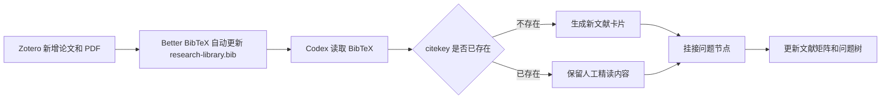

# 文献库持续变大时，如何同步更新 Obsidian

这个仓库的核心思想之一是：研究不是一次性整理完的。随着 Zotero 里论文越来越多，Obsidian 的问题树和文献矩阵也应该持续更新。

## 总流程



## 推荐目录

```text
<vault>/
├─ Zotero/
│  ├─ 导出文件/
│  │  └─ research-library.bib
│  ├─ 文献卡片/
│  ├─ 模板/
│  └─ 附件图片/
└─ 研究主题知识图谱/
   ├─ 01-文献矩阵.md
   ├─ 02-机器学习可切入问题.md
   └─ 问题节点/
```

## 第一次设置 Better BibTeX 自动导出

1. 打开 Zotero。
2. 建立一个专门 collection，例如 `Research Map`。
3. 把想纳入知识图谱的论文加入这个 collection。
4. 右键 collection，选择 `Export Collection...`。
5. Format 选择 `Better BibTeX`。
6. 勾选 `Keep updated`。
7. 文件保存为 `<vault>/Zotero/导出文件/research-library.bib`。

之后只要 collection 中新增或删除条目，`.bib` 会自动更新。

## Codex 如何处理变大的 BibTeX

给 Codex 的任务不是“重做整个库”，而是“增量更新”：

1. 读取 `research-library.bib`。
2. 读取 `Zotero/文献卡片/` 中已有 `citekey`。
3. 找出新增 citekey。
4. 为新增文献生成卡片。
5. 如果 PDF 路径存在，尝试精读；如果 PDF 缺失，标记 `status: imported`。
6. 根据 title、abstract、keywords 挂到问题节点。
7. 更新文献矩阵。
8. 输出新增、更新、缺 PDF、疑似重复四类清单。

## 推荐提示词

见 `prompts/01-import-bibtex.md`。增量更新时可以这样说：

```text
读取 <vault>/Zotero/导出文件/research-library.bib。
只处理 BibTeX 中新增的 citekey，不覆盖已有文献卡片的人工内容。
新增卡片后，更新 01-文献矩阵.md 和相关问题节点。
输出新增卡片、疑似重复、缺 PDF、需要人工精读的清单。
```

## 避免的问题

- 不要让 AI 覆盖已有 `PDF 精读证据`。
- 不要把 `.bib` 当成最终知识库，它只是同步接口。
- 不要把所有新增论文都直接设为核心文献。
- 不要把缺 PDF 的文献当成已精读。

## 推荐状态流转

```text
unread -> imported -> pdf-reviewed -> synthesized
```

- `unread`：只有 Zotero 条目。
- `imported`：已经生成 Obsidian 卡片。
- `pdf-reviewed`：Codex 或人工读过 PDF 并写入证据。
- `synthesized`：已经反映到问题节点或综述段落中。
