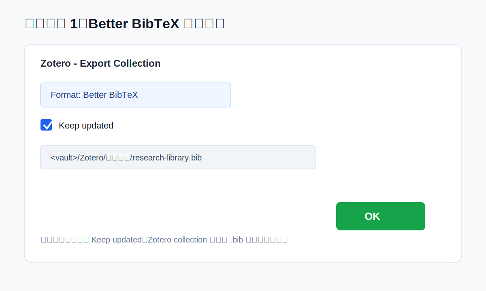
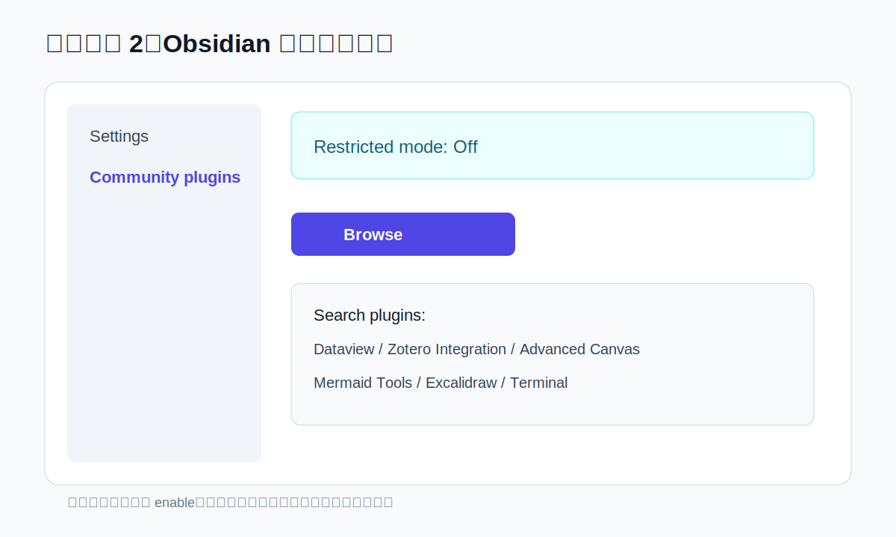
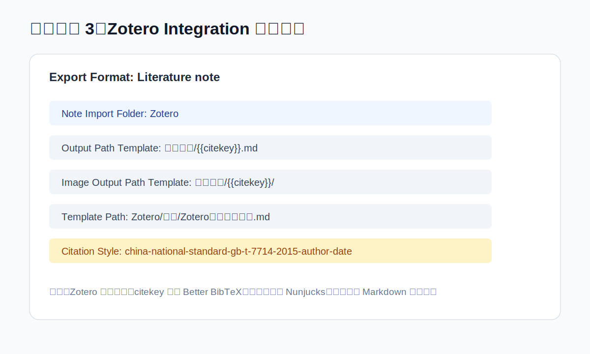
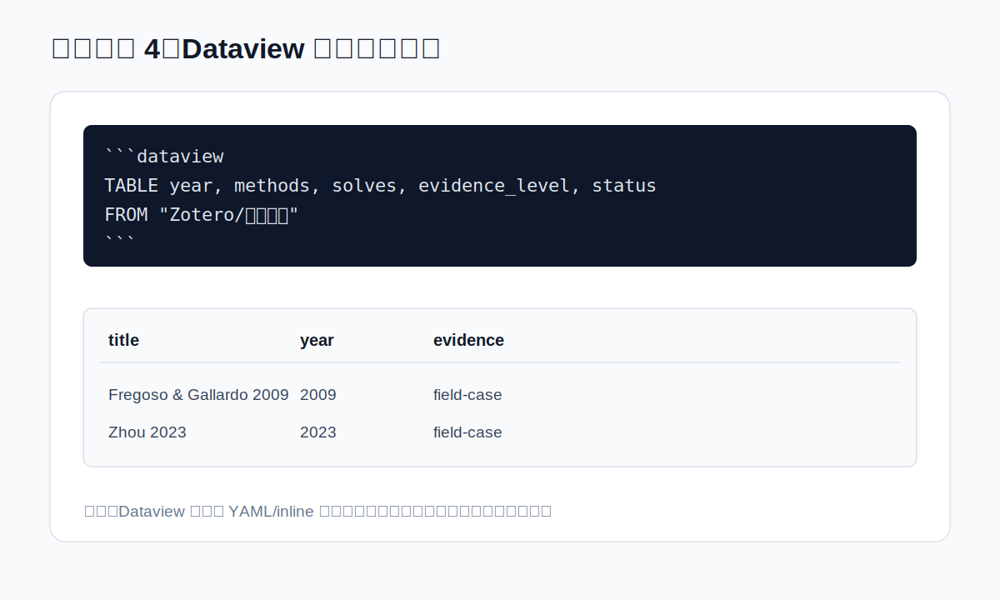
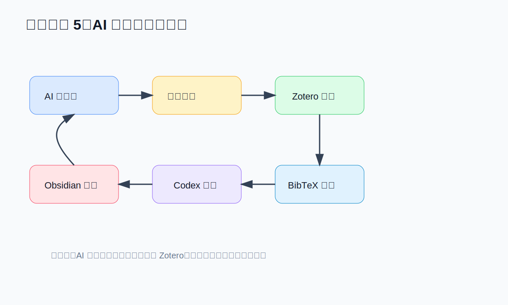

# 插件配置深度教程：截图、步骤和踩坑

这份教程对应一个完整的科研文献工作流：

```text
Zotero 保存 PDF 和元数据
-> Better BibTeX 自动同步 .bib
-> Obsidian Zotero Integration 生成文献卡片
-> Dataview 自动生成矩阵
-> Canvas / Mermaid / Excalidraw 展示问题树
-> Terminal / Codex 批量维护
```

> 说明：本文中的截图是“示意截图”，用于标注配置位置和字段含义；真实界面可能随插件版本变化。

## 0. 互联网教程入口

优先看官方或插件维护者文档：

- [Obsidian Community Plugins 官方说明](https://help.obsidian.md/community-plugins)
- [Better BibTeX 自动导出](https://retorque.re/zotero-better-bibtex/exporting/auto/)
- [Better BibTeX 主页](https://retorque.re/zotero-better-bibtex/)
- [Zotero 添加条目](https://www.zotero.org/support/adding_items_to_zotero)
- [Zotero Connector](https://www.zotero.org/download/connectors)
- [Zotero Connector 故障排查](https://www.zotero.org/support/troubleshooting_translator_issues)
- [Obsidian Zotero Integration](https://github.com/mgmeyers/obsidian-zotero-integration)
- [Zotero Integration 模板语法](https://github.com/mgmeyers/obsidian-zotero-integration/blob/main/docs/Templating.md)
- [Dataview 文档](https://blacksmithgu.github.io/obsidian-dataview/)
- [Dataview 查询结构](https://blacksmithgu.github.io/obsidian-dataview/queries/structure/)
- [Obsidian Copilot](https://github.com/logancyang/obsidian-copilot)
- [Text Generator](https://github.com/nhaouari/obsidian-textgenerator-plugin)

## 1. Zotero + Better BibTeX



### 目标

让 Zotero collection 变大时，自动更新一个 `.bib` 文件，Codex 再通过这个 `.bib` 增量更新 Obsidian。

### 操作步骤

1. 安装 Zotero Desktop。
2. 安装 Better BibTeX for Zotero。
3. 在 Zotero 中新建 collection，例如 `Research Map - Gravity Magnetic Inversion`。
4. 把要进入知识图谱的论文拖入这个 collection。
5. 右键 collection，选择 `Export Collection...`。
6. Format 选择 `Better BibTeX`。
7. 勾选 `Keep updated`。
8. 保存到 `<vault>/Zotero/导出文件/research-library.bib`。

### 推荐设置

- citekey 保持稳定，不要频繁改 citekey 规则。
- 文件名固定为 `research-library.bib`。
- 只导出研究 collection，不要导出整个 Zotero library。

### 踩坑

- **没勾 Keep updated**：`.bib` 不会自动更新，只是一次性导出。
- **删了 .bib 又自动出现**：说明这个自动导出仍在 Better BibTeX 的 automatic exports 里，需要在 BBT 设置中删除对应自动导出任务。
- **Zotero 7 看不到 Keep updated**：确认导出格式是 Better BibTeX/Better BibLaTeX，而不是普通 BibTeX；不同版本界面可能略有变化。
- **路径放错**：不要放到 Zotero `storage` 里，放到 Obsidian vault 的 `Zotero/导出文件/`。

## 2. Zotero Connector

### 目标

从网页、出版社页面、数据库页面把条目和 PDF 保存进 Zotero。

### 操作步骤

1. 安装浏览器版 Zotero Connector。
2. 打开 Zotero Desktop。
3. 打开论文的出版社页面或 DOI 页面。
4. 点击浏览器工具栏的 Zotero 保存按钮。
5. 检查 Zotero 中是否抓到了标题、作者、年份、DOI、PDF。
6. 把条目拖进研究 collection。

### 踩坑

- **只保存 PDF 不保存元数据**：尽量从论文详情页保存，不要直接拖 PDF。
- **Connector 按钮没反应**：确认 Zotero Desktop 正在运行。
- **Chrome/Edge 权限不足**：Zotero 官方建议检查 Connector 是否允许读取网站数据。
- **PDF 没自动下载**：可能没有权限；先保存元数据，再手动补 PDF。

## 3. Obsidian 社区插件安装



### 推荐安装顺序

1. Dataview。
2. Zotero Integration。
3. Mermaid Tools。
4. Advanced Canvas。
5. Excalidraw。
6. Terminal。
7. 可选：Copilot、Text Generator。

### 操作步骤

1. Obsidian 打开 `Settings`。
2. 进入 `Community plugins`。
3. 关闭 `Restricted mode`。
4. 点击 `Browse`。
5. 搜索插件名。
6. 点击 `Install`。
7. 安装后点击 `Enable`。

### 踩坑

- **安装了但没启用**：很多人卡在这一步，安装后还要 enable。
- **同步到新电脑插件失效**：`.obsidian/community-plugins.json` 只记录启用列表，插件本体可能需要重新下载。
- **AI 插件 data.json 不要公开**：Copilot/Text Generator 可能保存 provider、模型和 key。

## 4. Zotero Integration



### 目标

从 Zotero 导入文献卡片、引用、PDF 注释图片，并把卡片放进统一目录。

### 推荐配置

```json
{
  "database": "Zotero",
  "noteImportFolder": "Zotero",
  "outputPathTemplate": "文献卡片/{{citekey}}.md",
  "imageOutputPathTemplate": "附件图片/{{citekey}}/",
  "templatePath": "Zotero/模板/Zotero文献卡片模板.md",
  "openNoteAfterImport": true
}
```

### 操作步骤

1. 确认 Zotero Desktop 正在运行。
2. Obsidian 打开 `Settings -> Zotero Integration`。
3. `Database` 选择 `Zotero`。
4. `Note Import Folder` 写 `Zotero`。
5. 创建一个 import/export format。
6. `Output Path Template` 写 `文献卡片/{{citekey}}.md`。
7. `Image Output Path Template` 写 `附件图片/{{citekey}}/`。
8. `Template Path` 写 `Zotero/模板/Zotero文献卡片模板.md`。
9. Citation style 选择你的 CSL，例如 GB/T 7714。
10. 用一篇 Zotero 文献测试导入。

### 模板注意事项

Zotero Integration 使用 Nunjucks 模板语法，不是普通 Markdown 变量。常用变量包括：

```text
{{citekey}}
{{title}}
{{authorString}}
{{year}}
{{DOI}}
{{url}}
{{zoteroSelectURI}}
```

### 踩坑

- **citekey 为空**：先检查 Better BibTeX 是否安装、Zotero 条目是否有 citation key。
- **导入路径不对**：`noteImportFolder` 和 `outputPathTemplate` 是拼接关系；`Zotero` + `文献卡片/{{citekey}}.md` 才会进入 `Zotero/文献卡片/`。
- **模板变量不渲染**：检查模板文件路径是否正确，语法是否是 Nunjucks。
- **PDF 注释不出来**：确认注释在 Zotero PDF reader 中，且插件支持当前注释类型。
- **Zotero 未运行**：Obsidian 可能找不到条目。

## 5. Dataview



### 目标

把文献卡片 YAML 字段自动变成文献矩阵和问题节点表。

### 文献矩阵示例

```dataview
TABLE year, methods, solves, evidence_level, status
FROM "Zotero/文献卡片"
WHERE contains(["paper", "literature"], type)
SORT year ASC
```

### 问题节点表示例

```dataview
TABLE status AS "传统状态", ml_opportunity AS "ML机会", domains AS "适用域"
FROM "重磁反演知识图谱/问题节点"
WHERE type = "problem"
SORT ml_opportunity DESC
```

### 踩坑

- **字段名不统一**：`evidence_level` 和 `evidence-level` 是两个字段。
- **YAML 格式错**：数组、引号、冒号写错，Dataview 读不到。
- **把 wiki link 放进 Markdown 表格**：`[[a|b]]` 的 `|` 会撑坏普通 Markdown 表格，建议用 Dataview 或清单式矩阵。
- **Dataview 不会修改笔记**：它只查询和显示，真正写入还是靠 Codex/人工。

## 6. Mermaid Tools

### 目标

维护总览页里的 `mindmap`、`flowchart`、路线图。

### 推荐图类型

- `mindmap`：科学问题树。
- `flowchart LR`：工作流和同步闭环。
- `timeline`：方法发展脉络。

### 踩坑

- Mermaid 节点文字不要太长。
- 中文、括号和特殊字符太复杂时，建议用简单节点名。
- 图只放结构，不放证据；证据写回 Markdown。

## 7. Advanced Canvas

### 目标

用空间方式看问题树：左侧放科学挑战，右侧放文献矩阵、机器学习机会和 PDF 底稿。

### 操作步骤

1. 新建 Canvas。
2. 中央放总览文件。
3. 左侧放问题节点。
4. 右侧放文献矩阵、机器学习可切入问题、PDF 精读底稿。
5. 用 group 框分层：固有病态、联合耦合、模型可信度、ML 迁移。

### 踩坑

- Canvas 不适合放长文字。
- 不要把每篇文献都放进 Canvas，会变乱。
- Canvas 是导航和结构图，不是证据库。

## 8. Excalidraw

### 目标

画方法框架图、论文插图草稿和概念图。

### 推荐用途

- 画“Zotero -> BibTeX -> Codex -> Obsidian”工作流。
- 画“重磁联合反演结构耦合”的机制图。
- 画论文方法章节的初稿图。

### 踩坑

- Excalidraw 图很好看，但不适合作为唯一知识来源。
- 图中结论要能追溯到文献卡片或问题节点。

## 9. Terminal

### 目标

在 Obsidian 内运行维护命令。

### 常用命令

```powershell
git status --short
rg -n "pdf_path: \"\"" "Zotero/文献卡片"
rg -n "type: problem" "重磁反演知识图谱/问题节点"
rg -n "TODO|待补|缺 PDF" .
```

### 踩坑

- 删除/移动文件前先确认路径。
- Windows 中文路径可能导致脚本输出乱码，必要时设置 UTF-8。
- Terminal 插件只是便利入口，大规模修改仍建议让 Codex 检查。

## 10. Copilot 和 Text Generator

### 定位

这两个是可选 AI 插件，适合局部生成，不负责跨文件维护。

推荐分工：

- Copilot：问当前笔记、局部总结、轻量问答。
- Text Generator：生成段落初稿。
- Codex：跨文件读写、批量更新、读 PDF、GitHub 发布。

### 踩坑

- 不要公开 `data.json`。
- 不要把 API key 写进模板。
- AI 生成段落必须回到 PDF 证据核查。
- 不要让 Obsidian 内 AI 插件直接决定文献纳入。

## 11. AI 搜文献同步闭环



推荐流程：

1. AI 搜候选。
2. 人确认。
3. Zotero 保存条目和 PDF。
4. Better BibTeX 自动同步 `.bib`。
5. Codex 增量更新 Obsidian。
6. Dataview/Canvas 自动展示更新后的知识图谱。

### 最关键的坑

不要让 AI 直接写 Zotero。先让 AI 输出候选表和 DOI 列表，人工确认后再进入 Zotero。这一步能避免低质量文献、重复条目和错误元数据污染正式库。
