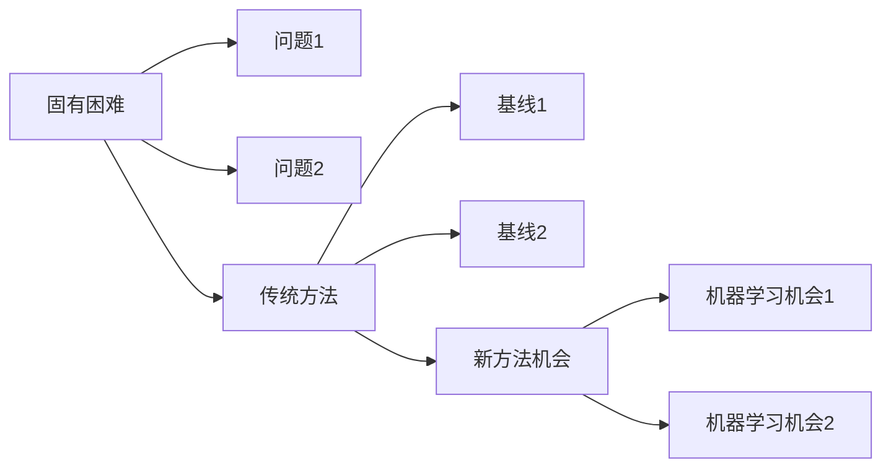

# 研究主题总览

## 入口

- [[00-问题树]]
- [[01-文献矩阵]]
- [[02-机器学习可切入问题]]
- [[Zotero/文献卡片/README]]

## 科学挑战地图



## Dataview 自动问题节点表

```dataview
TABLE status AS "状态", ml_opportunity AS "ML机会", domains AS "适用域"
FROM "问题节点"
WHERE type = "problem"
SORT ml_opportunity DESC
```
