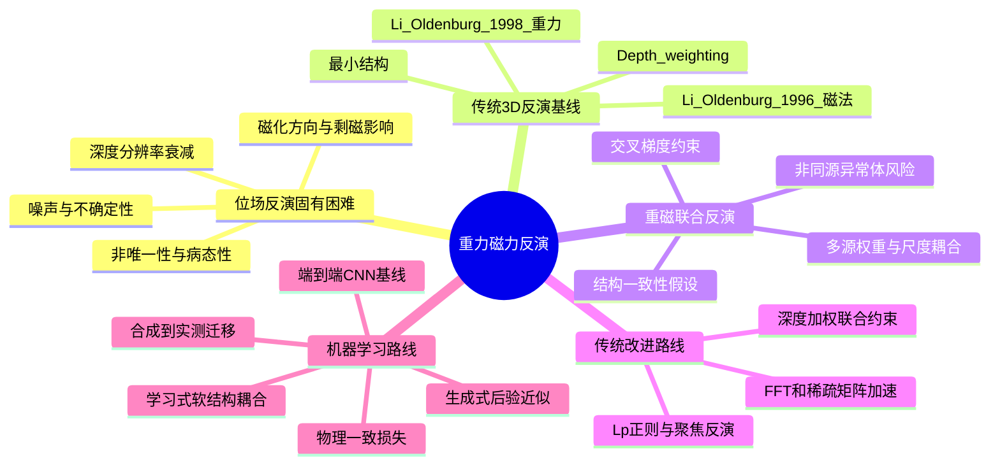

# 重力磁力反演问题树

## 读法

1. 从 Li & Oldenburg 读出位场反演的非唯一性和深度加权基线。
2. 从 Gallardo/Fregoso 读出交叉梯度如何把结构一致性变成约束。
3. 从 Vatankhah/Liu 读出传统方法如何改进效率和稀疏正则。
4. 从 Zhou/Fang/Bai 读出深度学习如何尝试学习结构相似性。
5. 从 Gupta/Jessell 读出生成式后验和合成数据泛化的前沿问题。
